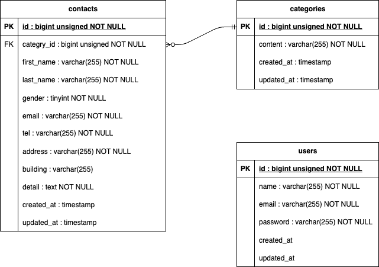

# FashionablyLate

## 概要
COACHTECH 基礎学習ターム 確認テスト  お問い合わせフォームアプリケーション

## 主な機能
- **お問い合わせフォーム**: 内容の入力・確認・送信、サンクスページの表示
- **認証**: 新規ユーザー登録、ログイン・ログアウト
- **管理画面**:
    - 送信されたお問い合わせの一覧表示
    - 名前、性別、お問い合わせ種類、日付による詳細検索
    - お問い合わせ内容の詳細表示および削除機能

## 環境構築
```bash
# リポジトリのクローン

git clone git@github.com:izumiyukari/fashionably-late.git
cd fashionably-late

# Dockerのビルド・起動
docker-compose up -d --build

# Laravelの初期設定
docker-compose exec php bash

# パッケージのインストール
composer install

# 環境設定ファイルの作成
cp .env.example .env
php artisan key:generate

# マイグレーション実行
php artisan migrate
exit
```

## 開発環境URL
- **[お問合せ画面]** [http://localhost/](http://localhost/)
- **[ユーザ登録]** [http://localhost/register](http://localhost/register)
- **[ログイン]** [http://localhost/login](http://localhost/login)
- **[phpMyAdmin]** [http://localhost:8080](http://localhost:8080)

## 使用技術(実行環境)
- PHP 8.1
- Laravel 8.83.29
- MySQL 8.0.26
- Nginx 1.21.1

## ER図
